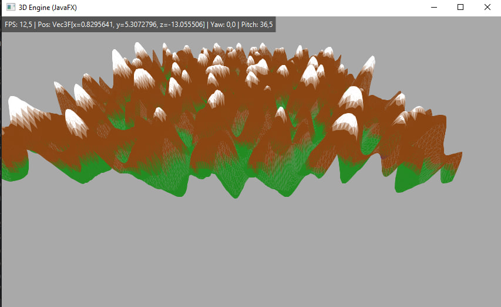

3D Renderer (Java / JavaFX)

Программный 3D-движок растеризации вокселей, написанный на Java с нуля без использования графических API (OpenGL, LWJGL, DirectX). Проект создан для исследования низкоуровневой математики 3D-графики, работы камеры и алгоритмов клиппинга.

 <!-- Вставьте скриншот вашего рендерера -->

---

## 🛠 Как это работает (Graphics Pipeline)

Движок берет блоки/чанки воксельного мира и полностью вручную проводит их через классический конвейер 3D-рендеринга на CPU:

* **Воксельная геометрия:** Преобразование блоков карты в сетку треугольников (Triangulation).
* **Камера и Трансформации:** Перевод координат из мирового пространства в пространство камеры на основе Yaw / Pitch углов (`Mat3F` / `Mat4F`).
* **Clipping (Near Plane):** Динамическое отсечение полигонов по ближней плоскости $Z_{\text{near}}$ с пересчетом вершин и интерполяцией цветов для предотвращения артефактов визуализации.
* **Перспективная проекция:** Перевод $3\text{D} \to \text{NDC} \to 2\text{D}$ экранные координаты.
* **Растеризация и Сортировка:** Отрисовка геометрии через Алгоритм художника (Painter's Algorithm) с сортировкой граней по глубине ($Z_{\text{avg}}$).

---

## 🚀 Производительность и Оптимизация

При отображении карты $40 \times 40$ блоков (до ~20 000 полигонов на кадр) движок держит стабильный FPS в зависимости от угла обзора.

### Текущее состояние и планы по оптимизации:
- [x] **Frustum Culling (Near Plane):** Корректная отсечка объектов вне поля зрения камеры.
- [x] **Culling угла обзора:** При повороте от карты производительность вырастает до лимита (60 FPS).
- [ ] **Occlusion Culling (Culled Meshes):** Удаление внутренних граней блоков, закрытых соседними блоками (сократит полигоны на ~70%).
- [ ] **Chunk-based AABB Culling:** Проверка видимости целых чанков $16 \times 16$ до обработки отдельных треугольников.
- [ ] **Z-Buffer & Pixel Buffer:** Переход от JavaFX `GraphicsContext` к ручному бафферу глубины для устранения overdraw и GC-нагрузки.

---

## 💻 Стек технологий

* **Язык:** Java 17+
* **Фреймворк:** JavaFX Canvas
* **Математика:** Собственные классы векторов и матриц (`Vec3F`, `Vec4F`, `Mat3F`, `Mat4F`)

---

## 🎮 Запуск и Управление

1. Клонируйте репозиторий:
   ```bash
   git clone [https://github.com/ваш-username/название-репозитория.git](https://github.com/ваш-username/название-репозитория.git)
